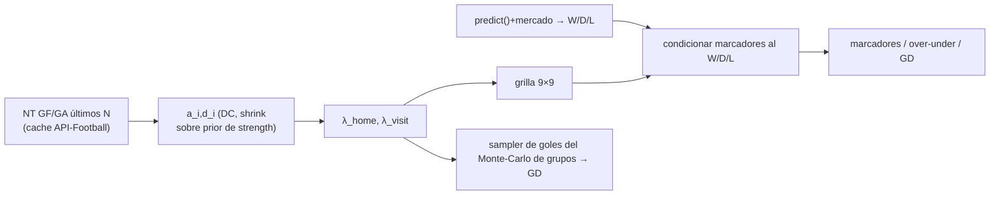

# 📐 Design Doc — Modelo de gol Ataque/Defensa (Dixon-Coles) — Fase A

> Escrito antes de codear (document-first). Fase A del roadmap de mejoras al
> modelo de pronóstico WC2026. Capa 4. **v2** tras validación Goldfish (§9).

- **Author:** César Torres · **Date:** 2026-06-14
- **Status:** SUPERADO por el rediseño score-first → ver `DESIGN_20260614_score-first-goal-model.md`. (Dos Goldfish mostraron que la variante outcome-first/no-toca-W/D/L no entrega valor; ver §10.)
- **Reviewers:** <tech lead>

## 1. Problem

El modelo deriva los goles esperados de ambos equipos de **un único rating de
fuerza simétrico** `get_strength(team)`:

```
λ_local = BASE · exp(K · (s_local − s_visit))     # BASE=1.3, K=1.5
λ_visit = BASE · exp(K · (s_visit − s_local))
```

Un solo número no distingue **perfil ofensivo de defensivo**: un equipo
compacto y de bajo gol (buena defensa, ataque modesto) produce el mismo λ que
cualquiera de su "fuerza". Consecuencia, **en la capa de goles**:

- marcadores/totales poco realistas para duelos de estilo asimétrico
  (favorito romo vs bloque bajo → debería tender a 1-0/0-0, no a goleada),
- **diferencia de gol (GD)** mal modelada — y GD alimenta el desempate de
  grupos **y el corte de mejores terceros** del motor de stakes/qualification
  (Fases 1-3 ya en repo), que hoy consume λ basado en fuerza única.

**Alcance honesto (corregido tras Goldfish §9):** la Fase A arregla la **capa
de gol/marcador/GD**. **NO** cambia el W/D/L (quién gana/empata) — eso sigue en
`predict()` + mercado. El W/D/L de un *upset por contragolpe* (p. ej. Australia
2-0 Türkiye, 2026-06-14, donde el modelo dio Australia 33.8% — no fue un fallo
grave) es un fenómeno de **estado-de-juego/transición → Fase D**, fuera de A.

Problema secundario: la fórmula de λ y sus constantes (`BASE=1.3`, `K=1.5`)
están **duplicadas** en `forecasting.py::_sample_goals` y
`prematch_analysis.py::conditioned_scorelines` — riesgo de divergencia.

## 2. Goals / non-goals

**Goals**
- Modelo de gol **Dixon-Coles** con factores **multiplicativos** de ataque
  (`a_i`) y defensa (`d_i`) en **unidades de gol**, alimentando λ.
- Estimar `a_i`/`d_i` desde **datos que ya obtenemos** (GF/GA de los últimos N
  partidos de selección), ajustado por rival y **encogido (shrink) hacia un
  prior derivado de `strength`** — en las unidades correctas (ver §3).
- Que el modelo alimente la **capa de gol/marcador/GD**: la grilla de
  `conditioned_scorelines` y el sampler de goles del Monte-Carlo de grupos.
- **Centralizar** el cálculo de λ (elimina la duplicación).
- **Reduce exactamente al modelo actual** con parámetros por defecto
  (γ_home=1, shrink=0) → backward-compatible, detrás de bandera.
- **Backtest a nivel de marcador** (no solo W/D/L) antes de activar.

**Non-goals**
- **No** tocar el W/D/L de `predict()` (la grilla se condiciona al W/D/L
  existente, como hoy). Un eventual *ensemble* DC↔predict para W/D/L queda como
  extensión futura separada, no Fase A (evita el doble conteo F3 y la
  incoherencia F6 detectados por Goldfish).
- xG (Fase C, limitado por datos). Estado-de-juego/transición (Fase D).
  Feature explícita de contragolpe (Fase E).

## 3. Proposal

**Dixon-Coles en espacio multiplicativo de goles**, anclado al prior de fuerza
en las unidades correctas, alimentando solo la capa de gol.

**3.1 Factores ancla (prior en unidades de gol).** Se mapea `strength` al
espacio multiplicativo con la MISMA exp que el modelo actual, partiendo el
exponente entre ataque y defensa:

```
ā_i = exp(K · (s_i − s̄))      # factor de ataque prior
d̄_i = exp(−K · (s_i − s̄))     # factor de fuga defensiva prior   (s̄ = media de strength)
```

Propiedad clave: `λ_home = μ · ā_home · d̄_away` con `μ=BASE` reproduce
**exactamente** `μ·exp(K·(s_home − s_away))` — el λ actual. Con los priors y
γ_home=1, el modelo es **idéntico al de hoy** (backward-compatible por
construcción). Esto **resuelve F1**: ya no se suma goles a strength; el prior
vive en el mismo espacio multiplicativo que λ.

**3.2 Actualización por señal de goles (shrink geométrico).** Se nudgea el
factor desde el prior hacia el ratio observado **ajustado por rival**, en
espacio log (mantiene positividad y unidades):

```
a_i = ā_i^(1−shrink) · (GF_adj_i / μ)^shrink
d_i = d̄_i^(1−shrink) · (GA_adj_i / μ)^shrink
```
donde `GF_adj_i` divide los goles a favor por el `d̄` del rival (y `GA_adj` por
el `ā` del rival), ponderando **competitivo > amistoso**. `shrink∈[0,1]`:
0 = solo prior (modelo actual), 1 = solo observado. **Mitiga F2** (muestra
chica/ruidosa) vía shrink fuerte + ajuste por rival.

**3.3 λ y grilla.**
```
λ_home = μ · a_home · d_away · γ_home
λ_visit = μ · a_visit · d_home
```
Grilla Poisson 9×9 (opcional: corrección DC de baja anotación, `ρ`). De ahí
salen totales/over-under/BTTS/marcadores **y** los goles del Monte-Carlo de
grupos (mejor GD). **El W/D/L NO sale de aquí**: la grilla se **condiciona al
W/D/L de `predict()`+mercado** (mecanismo ya existente en
`conditioned_scorelines`), preservando coherencia W/D/L↔marcadores (**evita
F6**).

**3.4 Ventaja local (resuelve F4).** El efecto local sobre **quién gana** ya
está en el factor crowd de `predict()`. `γ_home` afecta **solo la magnitud de
goles** (totales/forma), y como los marcadores se re-condicionan al W/D/L de
predict, no hay doble conteo. Default `γ_home=1` (apagado); calibrar aparte.
Nota co-anfitrión: no aplicar a todo `homeTeam` de football-data
indiscriminadamente.



## 4. Alternatives considered

- **Alt 1 — DC en unidades de gol, capa de gol, condicionado al W/D/L
  (ELEGIDA, v2).** Arregla F1 (prior en espacio multiplicativo), evita F4/F6
  (W/D/L intacto, marcadores condicionados), acota F3/F5 (no toca W/D/L).
  Reversible, default = modelo actual.
- **Alt 2 — DC también mezclado en W/D/L (ensemble).** Más potente pero
  reabre F3 (doble conteo de strength con predict) y F6 (mezclar W/D/L de dos
  modelos). Aplazada a extensión futura, fuera de Fase A.
- **Alt 3 — `strength + residuo` (v1 original).** Descartada: unidades
  incompatibles (F1, fatal) y doble conteo (F3).
- **Alt 4 — Reemplazar `predict()` por DC puro.** Tira crowd/afinidad/mercado.
  Riesgo alto. Descartada.

Decisión → **ADR-MODEL-001** al aprobar.

## 5. Impact

- **Security:** ninguno.
- **Data / migrations:** sin esquema. **Ratings `a_i`/`d_i` precomputados a un
  caché por equipo** (cubre tanto el path prematch como el Monte-Carlo de 48
  equipos de `run_forecast`, que **hoy NO llama a `probable_xi`** — hueco G5).
  Requiere exponer GF/GA numérico en `probable_xi` (hoy solo da el string del
  marcador) y un job/función que rellene el caché desde los fixtures ya
  cacheados (sin gasto extra de cuota).
- **Operation / cost:** marginal (grilla 9×9 ya en uso).
- **Testing:** unit del estimador (shrink=0 ⇒ priors; ajuste por rival;
  ponderación amistoso) y de la grilla (probas suman 1; defensa rival alta
  suprime λ; γ_home=1 ∧ shrink=0 ⇒ λ idéntico al actual). **Backtest de
  marcador** nuevo: el ledger actual solo puntúa W/D/L (Brier); Fase A no mueve
  W/D/L, así que la métrica de activación es **a nivel de gol** (calibración de
  over/under, BTTS, log-loss de marcador / distribución de GD), no Brier W/D/L.

## 6. Implementation plan

1. **PR1 — Centralizar λ (refactor puro).** Función única
   `goal_model.expected_goals(home, away, *, gamma_home=1.0) -> (λ_home,
   λ_visit)` (firma fija; resuelve G8/F7), usada por `_sample_goals` y
   `conditioned_scorelines`. Test de equivalencia byte a byte con el actual.
2. **PR2 — Exponer GF/GA + caché de ratings.** Refactor de `probable_xi` para
   surtir GF/GA numérico; módulo que precomputa `a_i/d_i` (DC + shrink) a un
   caché por equipo, consumible por ambos paths.
3. **PR3 — `expected_goals` usa a_i/d_i** (en vez de strength puro) detrás de
   bandera `DC_GOAL_MODEL` (default off ⇒ usa priors ⇒ idéntico). Tests.
4. **PR4 — Backtest de marcador** sobre el ledger (añadir evaluación a nivel de
   gol/GD) comparando bandera off vs on.
5. **PR5 — Calibrar y activar.** Ajustar `shrink`, `N`, peso amistoso, `γ_home`,
   `ρ`; **subir la bandera solo si** mejora la calibración de marcador/GD sobre
   **≥20 partidos** terminados (gate concreto; resuelve G7).

## 7. Risks and mitigations

| Riesgo | Mitigación |
|---|---|
| F2 muestra chica/amistosos | shrink fuerte hacia prior + ajuste por rival + peso competitivo>amistoso |
| F1 unidades | Prior en espacio multiplicativo (exp de strength); shrink geométrico — todo en unidades de gol |
| F3 doble conteo de strength | A **no toca W/D/L**; el prior de a/d es strength pero solo afecta goles, no se mezcla con el W/D/L de predict |
| F4 doble localía | γ_home solo escala goles; W/D/L (con crowd) intacto; default γ_home=1 |
| F6 incoherencia W/D/L↔marcador | Marcadores condicionados al W/D/L final (mecanismo existente) |
| Sobre-ajuste a anécdotas | Gate de ≥20 partidos a nivel de marcador; no tunear con un resultado |
| Plumbing Monte-Carlo (G5) | Caché de ratings por equipo consumido por ambos paths |
| Divergencia de λ | PR1 centraliza antes de tocar conducta |

## 8. Open questions

- Valores iniciales a calibrar (no bloquean diseño): `shrink≈0.3`, `N≈6`, peso
  amistoso `≈0.5`, `γ_home=1.0`, `ρ=0` (DC-corr off). ¿De acuerdo como punto de
  partida?
- Ajuste por rival: ¿una pasada con priors (simple) o iterativo? (Lean: una
  pasada — muestra chica no justifica iterar.)
- Secuencia con Fase B (estilo de mercado): B podría calibrar/relevar `γ_home`
  y el total; ¿A→B o solaparlas?

## 9. Goldfish validation (2026-06-14) y cómo la v2 responde

v1 (sesión fresca) → veredicto **no autosuficiente**; hallazgos y resolución:

- **F1 (unidades, fatal):** v2 usa prior en **espacio multiplicativo**
  (`exp` de strength), shrink geométrico → todo en unidades de gol. **Resuelto.**
- **F3 (doble conteo strength):** v2 **no mezcla DC en W/D/L**; A solo toca la
  capa de gol. **Acotado.**
- **F4 (doble localía):** γ_home solo escala goles; W/D/L con crowd intacto.
  **Resuelto.**
- **F5 (¿arregla el problema?):** v2 **re-motiva honestamente** — A arregla
  marcador/GD/compacidad, NO el W/D/L del contragolpe (Fase D). **Resuelto.**
- **F6 (blend incoherente):** sin blend de W/D/L; marcadores condicionados.
  **Resuelto.**
- **F7/G8 (firmas, PR1 circular):** firma de `expected_goals` fijada; gate de
  activación a nivel de marcador sobre ≥20 partidos. **Resuelto.**
- **G1 parámetros:** valores de arranque pineados (§8). **Resuelto** (a calibrar).
- **G5 plumbing Monte-Carlo / G6 persistencia:** caché de ratings por equipo
  para ambos paths; GF/GA expuesto en `probable_xi`. **Resuelto.**
- **G2 "league_media":** ya no aplica (no hay término aditivo de media; el
  prior es `exp` de strength relativo a `s̄`). **Obsoleto.**

Decisiones del autor incorporadas: (1) **DC en unidades de gol**; (2)
**re-motivar y mantener A**.

> Próximo paso del loop: **re-correr el Goldfish sobre esta v2** con sesión
> fresca; si pasa, ADR-MODEL-001 + implementación desde PR1.

## 10. Goldfish v2 (2026-06-14) — fallo conceptual persistente

Veredicto: **sigue sin ser autosuficiente y conserva un fallo conceptual
BLOQUEANTE.** El álgebra de §3.1 es correcta (verificada: reduce exacto al λ
actual, `s̄` cancela) y el beneficio de **over/under + BTTS** es real. Pero:

- **Flaw #1 (bloqueante) — el beneficio de GD es arquitectónicamente
  imposible tal como está.** `forecasting._sim_group` **elige primero el W/D/L**
  (vía `predict()`+mercado, un `random()`), y **luego** muestrea goles
  *condicionados a ese resultado* (`_sample_goals`, con fallback fijo
  1-0/1-1/0-1). Como la Fase A **no toca el W/D/L**, el **signo de la GD por
  partido queda fijado** por el sorteo de resultado; el nuevo λ solo reescala el
  margen *dentro* del resultado → efecto de segundo orden sobre la GD
  acumulada. El titular "mejor GD → mejor desempate de grupos / corte de
  terceros" (que pasa por `stakes.py`/`qualification.py`, ambos vía
  `_sim_group`) está **sobre-vendido**.
- **Lo que SÍ sobrevive (cuantificado):** en `conditioned_scorelines`, fijando
  el W/D/L y cambiando solo el perfil de λ, over-2.5 se mueve 0.51→0.26 → el
  realismo de **totales/over-under/BTTS/forma del marcador en prematch es
  real**. La GD, en cambio, queda casi fijada por las masas W/D/L → marginal.
- **Otros huecos:** `GF_adj/GA_adj` es prosa, no fórmula, y el rival no-WC
  cae a `_DEFAULT_STRENGTH` (ajuste por rival casi inerte, sesgado);
  `GF_adj=0` con `shrink>0` ⇒ `λ=0` (sin ε-floor) ⇒ el sampler cae al fallback
  fijo y **destruye la señal de compacidad justo donde importa**; la ruta
  Monte-Carlo de 48 equipos necesitaría `find_team_id`+fixtures por equipo
  (~576 requests ≈ 6 días de cuota gratuita) → la afirmación "sin cuota extra"
  es falsa para ese path; el **gate de ≥20 partidos es inalcanzable hoy** (14
  partidos, 0 marcadores guardados, scorer de gol inexistente) → G7 estaba
  marcado "resuelto" prematuramente; staleness del caché de ratings sin definir.
- **No-doble-conteo (F4/F8):** genuinamente cerrado — pero *por la misma razón*
  que hace fatal a Flaw #1 (la arquitectura outcome-first).

**La encrucijada (decisión de alcance, del autor):**
- **(A) Re-acotar A** a lo que sobrevive: realismo de over/under+BTTS+forma de
  marcador en prematch. Honesto y de bajo riesgo, pero **modesto** (display de
  prematch; no mejora stakes/GD).
- **(B) Cambiar `_sim_group` a *score-first***: muestrear goles primero del λ
  DC y *derivar* el W/D/L del marcador. Entrega el beneficio real (GD + W/D/L
  sensibles a ataque/defensa) pero **reabre el W/D/L** (coherencia con
  predict/mercado/crowd/afinidad, F3/F6) → deja de ser "A no toca W/D/L"; en la
  práctica **fusiona A con la pieza de W/D/L que habíamos diferido a Fase D**.
- **(C) Archivar A** y atacar la palanca real del upset por contragolpe:
  estado-de-juego (Fase D) o estilo de mercado (Fase B).

> Aprendizaje del loop (anti-complacencia): dos sesiones frescas mostraron que
> la versión "limpia y que no toca W/D/L" entrega poco, y la versión valiosa es
> más grande. Se descubrió **antes de escribir código**.
