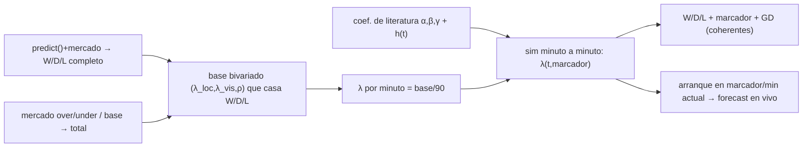

# 📐 Design Doc — Simulación time-stepped con efectos de marcador (Fase D)

> Document-first. Mejora del modelo WC2026. Capa 4. Reemplaza el sorteo de gol
> de un solo tiro por una **simulación minuto-a-minuto con intensidades
> dependientes del marcador**. Integra las lecciones de 3 rondas Goldfish
> previas (ver `DESIGN_20260614_score-first-goal-model.md` §10).

- **Author:** César Torres · **Date:** 2026-06-14
- **Status:** RECHAZADO (Goldfish #4, §10): el fix de ρ es infactible en el régimen real + costo ~90× inviable + valor admitidamente nulo en el Brier pre-partido. 4ª ronda, 4º fallo bloqueante → se recomienda PARAR la familia de mejoras al modelo de gol.
- **Reviewers:** <tech lead>

## 1. Problem

El modelo no tiene **dinámica de estado-de-juego**: simula el partido como un
único sorteo de goles (hoy, además, outcome-first). No puede representar que un
equipo que va **perdiendo se vuelca** (ataca más y **concede más** en contra) —
el mecanismo exacto del upset **Australia 2-0 Türkiye** (1-0 → Turquía se
vuelca → 2-0 en contra). Consecuencias:

- La **distribución condicional/tardía** es irreal: tasa de remontadas, ventajas
  conservadas, goles tardíos, y el reparto 2-0-vs-1-0 dado un gol temprano.
- La **cola de GD** (que alimenta el desempate de grupos y el **corte de
  mejores terceros**, `stakes.py`/`qualification.py`) no refleja que los
  partidos se abren cuando alguien persigue.

Objetivo: una sim **minuto-a-minuto** donde las intensidades de gol dependen de
(marcador actual, minutos restantes), reemplazando el sorteo único en el
Monte-Carlo de grupos/torneo.

**Honestidad de alcance (lecciones de los 3 Goldfish previos):** esto **hereda**
el problema de calibrar el base-λ contra el W/D/L ya calibrado (Flaw A del
score-first) y le suma **datos que no tenemos** + **costo** + **blast radius**.
El diseño los confronta abajo; si no se sostienen, el Goldfish lo dirá.

## 2. Goals / non-goals

**Goals**
- Sim **minuto-a-minuto**: por minuto, intensidades `λ_loc(t,d)`, `λ_vis(t,d)`
  moduladas por el marcador `d` y el minuto `t`.
- **Base anclado al W/D/L COMPLETO de predict+mercado** (bivariado de 3
  parámetros con correlación `ρ` para casar W, D y L — el fix de Flaw A), para
  **no regresar** la calibración pre-partido. Total de mercado/base.
- **Efectos de marcador con coeficientes de LITERATURA** (fijos, citados), NO
  estimados de nuestros datos (no tenemos tiempos de gol).
- **Reduce al modelo actual** con efectos en 0 (la suma de 90 min homogéneos =
  Poisson actual). **Bandera** off por defecto.
- **Bonus:** el **modelo en vivo** sale como caso especial (arrancar la sim
  desde el marcador/minuto actual) → productiza lo que hicimos a mano hoy.
- Reemplaza `_sim_group` (forecasting/stakes/qualification) + el torneo, tras
  bandera.

**Non-goals**
- **Ganarle al mercado en el Brier pre-partido promedio.** El valor es
  **realismo CONDICIONAL/in-game + cola de GD**, no la media pre-partido. (Si lo
  que se busca es Brier pre-partido, esto NO es; el mercado ya calibra.)
- Estimar/validar coeficientes de efecto-marcador desde datos propios (no hay).
- xG (Fase C). Feature por jugador (E).

## 3. Proposal

**3.1 Base calibrado (hereda y arregla Flaw A).** Para cada partido, hallar
`(λ_loc, λ_vis, ρ)` de un Poisson bivariado que **reproduce las TRES** masas
`(p_loc, p_x, p_vis)` de predict+mercado (3 objetivos, 3 parámetros) y un total
(mercado over/under o base). Esto evita descartar el empate calibrado. Per-min
base: `λ·/90`.

**3.2 Capa de efecto-marcador (literatura).** En el minuto `t` con ventaja local
`d = g_loc − g_vis`, modular:
```
equipo que PIERDE: ataque ×(1+α·h(t)),  fuga defensiva ×(1+β·h(t))
equipo que GANA  : ataque ×(1−γ·h(t)) (se repliega) [+ bonus contra opcional]
```
con `h(t)` creciente hacia el final (p. ej. 0 al inicio → 1 en el tramo final),
y `α,β,γ` de literatura de *score effects* (rangos publicados: el que pierde
anota ~+15-30% y concede más en el tramo final). `α=β=γ=0` ⇒ base puro.

**3.3 Sim.** N=90 pasos; por paso, gol de cada equipo ~ Bernoulli/Poisson de
media `λ·_min(t,d)`; acumular; marcador final → resultado+marcador. W/D/L y GD
**emergen** del proceso (coherentes por construcción).

**3.4 Integración.** Reemplazar el cuerpo de `_sim_group` tras bandera
`GAME_STATE_SIM` (default off); ídem torneo (`_simulate_once`) y los callers
`stakes.py`/`qualification.py`. `conditioned_scorelines` puede exponer la
distribución condicional.

**3.5 Reduce al actual.** Con `α=β=γ=0` y base = λ actual, la suma de 90 min
homogéneos ≈ la Poisson marginal de hoy (equivalencia en distribución).

**3.6 Modelo en vivo (caso especial, gratis).** Arrancar la sim en
`(marcador actual, minuto actual)` con el mismo motor → P(local/empate/visita)
+ marcadores finales en vivo. Es lo que calculamos a mano en Australia-Türkiye.



## 4. Alternatives considered

- **Minuto-a-minuto (ELEGIDA).** Transparente y flexible; el modelo en vivo
  sale gratis. Costo el riesgo principal.
- **Segmentado (bloques de 15')**. Más barato, más grueso. Fallback si el costo
  del minuto-a-minuto no cierra.
- **Ajuste analítico de efectos (sin sim).** Difícil con dependencia de estado.
- **Mantener el sorteo único (status quo).** Sin dinámica; descartado por la
  decisión de hacer Fase D.

Decisión → **ADR-MODEL-002** al aprobar.

## 5. Impact

- **Blast radius ALTO:** `_sim_group` (3 callers) + `_simulate_once` + prematch.
  Bandera off por defecto + test de equivalencia obligatorios.
- **Datos:** los coeficientes `α,β,γ,h(t)` vienen de **literatura publicada de
  score effects** (fijos, citados). **No** se pueden estimar **ni validar
  directamente** con nuestros datos (free tier sin tiempos de gol). Se declara
  abiertamente; el gate es indirecto (§testing).
- **Costo (riesgo real):** minuto-a-minuto = ~**90× el trabajo por partido**.
  `build_cutoff` (2000 sims × 12 grupos), `stakes` (8–20k), `run_forecast`
  (50k) → puede ser prohibitivo en Python puro. Mitigar: vectorizar, menos
  sims, o pasos de 5/15'. **Benchmark obligatorio en PR3.**
- **Testing:** equivalencia con `α=β=γ=0` (en distribución); **gate de NO
  regresión del Brier W/D/L pre-partido** en el ledger; chequeo de **dinámica
  agregada vs literatura** (% remontadas, ventajas conservadas, goles tardíos);
  sanidad de la trayectoria en vivo contra resultados que se vayan dando.

## 6. Implementation plan

1. **PR1 — Base calibrado (fix Flaw A).** Inversión `(W/D/L completo, total) →
   (λ_loc, λ_vis, ρ)` del bivariado. Puro, tests. (Reutilizable.)
2. **PR2 — Motor time-stepped.** Loop por minuto + funciones de efecto +
   coeficientes de literatura; test de equivalencia con efectos en 0.
3. **PR3 — Cableado + costo.** `_sim_group`/torneo/stakes/qualification tras
   `GAME_STATE_SIM` (off); **benchmark de costo** y decisión de granularidad.
4. **PR4 — Backtest.** No-regresión de Brier pre-partido (ledger) + dinámica
   agregada vs literatura; sanidad en vivo.
5. **PR5 — Calibrar y activar.** `α,β,γ,h(t)` dentro de rangos de literatura;
   subir bandera si **no regresa** el pre-partido y mejora el realismo
   condicional.

## 7. Risks and mitigations

| Riesgo | Mitigación |
|---|---|
| Hereda sobre-determinación del base (Flaw A) | Bivariado de 3 params (ρ) que casa W/D/L COMPLETO (PR1) |
| Coeficientes no validables con datos propios | Priors de literatura, suaves; gate = no-regresión + dinámica agregada; es feature de realismo condicional, no de Brier |
| Costo 90× (MC prohibitivo) | Benchmark; vectorizar; granularidad 5/15'; menos sims; bandera |
| Blast radius / regresión | Bandera off; equivalencia α=β=γ=0; gate de no-regresión en ledger |
| No mueve el Brier pre-partido | Honesto: el valor es condicional/in-game + cola GD; declarado non-goal |
| `_sim_group` callers sin mercado (stakes/qualif) | Base usa predict (sin mercado) en ese path, como hoy; total = base |

## 8. Open questions

- **Granularidad** (1' vs 5'/15') según el benchmark de costo.
- **Forma exacta** de `h(t)` y **qué coeficientes publicados** usar (citar).
- **Inversión del base** con ρ: ¿método numérico estable para casar 3 masas?
- ¿El **modelo en vivo** (caso especial) se expone como endpoint propio en esta
  fase o en una posterior?
- ¿El total del base sigue dependiendo del mercado over/under (que **aún no se
  obtiene** — heredado del doc score-first) o de la base por fuerza? Si es base,
  documentar que el canal de "compacidad" es débil.

## 9. Estado del loop

Diseño que pretendía integrar las 3 lecciones Goldfish previas. **El Goldfish
#4 (2026-06-14) lo RECHAZÓ — ver §10.**

## 10. Goldfish #4 — rechazo y cierre de la familia

Veredicto: **no autosuficiente; fallos conceptuales y de factibilidad
bloqueantes.** Lo decisivo:

- **Flaw 1 — el fix de ρ no se sostiene.** "3 params (λ_loc,λ_vis,ρ) casan el
  W/D/L COMPLETO **y** un total" son **4 objetivos sobre 3 parámetros** →
  sigue sobre-determinado. Y la Poisson bivariada estándar (Holgate) solo
  admite **ρ≥0** → solo puede **subir** el empate vs independencia, nunca
  bajarlo; pero `predict()` **suprime** el empate en partidos desbalanceados
  (`_DRAW_SCALE=1.2`) → hay casos con empate objetivo **por debajo** del
  independiente → **inalcanzables**. El "arreglo de Flaw A" es infactible en el
  régimen real (salvo cópula, que reabre la fragilidad ya rechazada).
- **Flaw 2 — costo inviable.** ~**650M sorteos por minuto por `/forecast`**
  (50k torneos × ~72 partidos × 180 draws) y ~**34M por llamada de stakes**, en
  Python puro y dentro del request. Vectorizar un loop **dependiente del estado**
  (la intensidad depende del marcador acumulado) es duro (solo se vectoriza
  entre sims, no entre minutos). Y el benchmark estaba **después** de construir
  PR1+PR2.
- **Flaw 3 — "reduce al actual" incoherente** (RNG distinto; `base/90` **no
  preserva ρ**: 90 incrementos i.i.d. → correlación 0).
- **Flaws 4-7 — coeficientes no transferibles ni validables; gate mal cableado
  otra vez (el ledger puntúa `predict`, no `_sim_group`); callers sin mercado
  (los de GD) sin especificar; valor admitidamente nulo en Brier pre-partido y
  beneficio de cola-GD de segundo orden** (la GD solo desempata con puntos
  iguales, en estados ya decididos).

**Conclusión del LOOP (4 rondas, 4 fallos bloqueantes): PARAR la familia de
mejoras al modelo de gol.** El apalancamiento no está ahí: dato propio débil,
arquitectura outcome-first, y el W/D/L de predict+mercado **ya calibra** (el
mercado gana). El design-loop hizo exactamente su trabajo: **evitó 4
implementaciones defectuosas antes de codear** — incluida una reescritura del
path core de costo ~90× que habría regresado la calibración. Opción barata
única si se insiste: experimento **segmentado a 15'** (no minuto-a-minuto).
Recomendado: consolidar el aprendizaje en un **ADR de rechazo** y cerrar.
