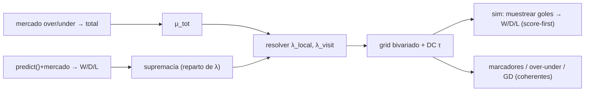

# 📐 Design Doc — Modelo de gol score-first (Poisson bivariado: supremacía + total)

> Document-first. Mejora del modelo de pronóstico WC2026. Capa 4.
> **Sustituye** a `DESIGN_20260614_attack-defense-split.md` (dos rondas Goldfish
> mostraron que un split atk/def *que no toca el W/D/L* no entrega GD/valor por
> la arquitectura outcome-first).

- **Author:** César Torres · **Date:** 2026-06-14
- **Status:** BLOQUEADO (Goldfish #3, §10: sobre-determinación → regresión del empate calibrado; totales de mercado inexistentes); decisión estratégica pendiente
- **Reviewers:** <tech lead>

## 1. Problem

El simulador es **outcome-first**: `forecasting._sim_group` elige el W/D/L con
`predict()`(+mercado) y **luego** muestrea goles condicionados a ese resultado
(`_sample_goals`, con fallback fijo 1-0/1-1/0-1). Consecuencias (verificadas):

- El **modelo de gol (λ) no puede influir en el W/D/L** ni, de forma material,
  en la **GD**: el signo de la GD lo fija el sorteo de resultado; λ solo
  reescala el margen dentro del resultado. → No se puede capturar "equipo
  compacto/bajo marcador empata más" ni mejorar la GD que alimenta el desempate
  de grupos y el **corte de mejores terceros** (`stakes.py`/`qualification.py`,
  ambos vía `_sim_group`).
- λ es **fuerza única simétrica** `μ·exp(K·(s_h−s_a))` — no representa estilo
  (compacto vs abierto), y está **duplicado** en `_sample_goals` y
  `conditioned_scorelines`.

Objetivo: un modelo **coherente** donde un solo proceso de goles produzca W/D/L
**y** marcadores **y** GD, de modo que la compacidad/estilo influya en los
empates y en la GD, validable en el ledger de W/D/L existente.

## 2. Goals / non-goals

**Goals**
- **Score-first:** muestrear `(g_local, g_visit)` de un Poisson bivariado
  `(λ_local, λ_visit)`; `W/D/L = signo(g_local − g_visit)`. W/D/L y marcadores
  salen del **mismo** sorteo → coherentes por construcción (se elimina el
  condicionado).
- **Descomponer λ en SUPREMACÍA y TOTAL** (la idea central):
  - **Supremacía** (quién es mejor) ← anclada al W/D/L de `predict()`+mercado
    → **reusa** las features ya validadas (fuerza, crowd, afinidad, stage) sin
    tirarlas.
  - **Total** de goles (estilo/compacidad) ← del **mercado over/under** cuando
    está disponible (robusto, bien calibrado, esquiva la estimación frágil
    desde datos NT escasos que el Goldfish marcó); fallback a una línea base.
  - A total fijo, **menor total ⇒ mayor probabilidad de empate** → la
    compacidad mueve el W/D/L en la dirección correcta (efecto que el diseño
    anterior no lograba).
- Corrección **Dixon-Coles** de baja anotación (τ) para calibrar la frecuencia
  de empates.
- **Bandera** + reduce a ~modelo actual con total=actual y supremacía=predict.
- **Gate = el ledger de W/D/L (Brier) existente** + calibración de marcador.
  (Como ahora el W/D/L **sí** se mueve, el gate es satisfacible — se resuelve
  el "no hay sustrato de backtest" del Goldfish anterior.)
- **Unifica** el cálculo de λ/grilla (mata la duplicación).

**Non-goals**
- Dinámica de **estado-de-juego** (el que pierde se vuelca → concede en contra):
  el upset de Australia es en parte esto. Score-first mejora la distribución
  **estática**, no el feedback in-game → sigue siendo **Fase D**.
- **xG** (Fase C, limitado por datos). Feature de transición por jugador (E).
- Estimación bespoke de atk/def desde resultados NT (rechazada: el Goldfish
  mostró fragilidad — muestra chica, rival no-WC inerte, λ=0 degenerado).

## 3. Proposal

**3.1 Descomposición.** Para un partido, fijar:
```
total      μ_tot = λ_local + λ_visit          # de mercado over/under, o base
supremacía relación λ_local : λ_visit         # de predict()+mercado (W/D/L)
```
Resolver `(λ_local, λ_visit)` desde `(μ_tot, supremacía)`. Como el total se fija
primero, la supremacía es un problema **1-D bien planteado** (no ambiguo).

**3.2 Supremacía desde el W/D/L de predict+mercado.** Dado el W/D/L objetivo
`(p_loc, p_x, p_vis)` (= salida actual de `predict()` mezclada con mercado) y un
`μ_tot`, hallar el reparto de λ cuyo Poisson bivariado reproduce el balance
local-vs-visita objetivo (p. ej. casar `p_loc/(p_loc+p_vis)`). El empate
resultante NO se fuerza: emerge del total (más bajo ⇒ más empate).

**3.3 Total.**
- **Tier 1 (preferido):** del **mercado over/under** (de-vig → goles totales
  implícitos). Ya consumimos el Odds API para h2h; añadir el mercado de
  totales. Robusto y sin estimación NT.
- **Tier 2 (fallback):** línea base ≈ total implícito actual
  (`μ·(exp(K·Δs)+exp(−K·Δs))`), con ajuste suave. Documentar cobertura de
  totales de mercado por partido.

**3.4 Grilla + DC.** `P(i,j)=pmf(i,λ_loc)·pmf(j,λ_vis)` con corrección DC `τ`
en (0-0,1-0,0-1,1-1) para ajustar empates de bajo marcador. W/D/L = sumas del
grid; marcadores = el grid.

**3.5 Score-first en el sim.** En `_sim_group`, sustituir
"predict→resultado→goles condicionados" por **muestrear `(g_loc,g_vis)` del
grid; resultado = signo**. `conditioned_scorelines` pasa a usar la **misma**
grilla (unificación; ya no condiciona — la coherencia es nativa).

**3.6 Eliminación directa.** El grid da empate; en KO se redistribuye la masa
de empate a local/visita (mecanismo que la ruta ya aplica para mercado).



## 4. Alternatives considered

- **Alt 1 — Score-first; supremacía=predict+mercado, total=mercado (ELEGIDA).**
  Reusa features validadas, evita estimación NT frágil, W/D/L coherente con GD,
  compacidad→empates, gate = ledger existente. Riesgo: cambia el path core.
- **Alt 2 — Score-first con λ de atk/def estimados de resultados NT.**
  Rechazada: fragilidad de datos (Goldfish), tira features de predict.
- **Alt 3 — Reemplazar `predict()` por bivariado puro.** Pierde
  crowd/afinidad/stage. Rechazada.
- **Alt 4 — Mantener outcome-first + capa atk/def (doc anterior).** Rechazada:
  imposibilidad arquitectónica de mover GD/W/D/L (Goldfish v2).

Decisión → **ADR-MODEL-001** al aprobar.

## 5. Impact

- **Cambia el path CORE** (`_sim_group`) y `conditioned_scorelines` → **riesgo
  más alto** → bandera + test de equivalencia en defaults + backtest cuidadoso.
- **W/D/L se mueve** (compacidad→empates) → el **ledger de Brier existente es
  el gate** (se resuelve el problema de "sin sustrato de backtest" del Goldfish
  anterior).
- **Data:** total desde el mercado over/under del Odds API (nueva llamada,
  mismo proveedor, cuota modesta); supremacía reusa predict+h2h existente. **Sin
  estimación atk/def desde datos NT** → esquiva la fragilidad (Flaws #4/#5 del
  Goldfish anterior).
- **Cost/op:** mismo grid 9×9; muestrear del grid en el MC es marginal.
- **Testing:** unit (grid suma 1; inversión de supremacía reproduce el W/D/L
  objetivo a total base; **total más bajo ⇒ más empate**; reduce a ~actual con
  total=actual ∧ supremacía=predict); backtest **W/D/L Brier + calibración de
  over/under/marcador** sobre partidos que se vayan acumulando.

## 6. Implementation plan

1. **PR1 — Unificar λ/grilla** (refactor): una función de grilla usada por
   `_sample_goals` y `conditioned_scorelines`. Test de equivalencia.
2. **PR2 — Inversión supremacía + grilla DC.** Puro: `(W/D/L objetivo, μ_tot)`
   → `(λ_loc,λ_vis)` → grid con `τ`. Tests.
3. **PR3 — Total de mercado.** Fetch over/under del Odds API → μ_tot; fallback
   base. Tests + cobertura.
4. **PR4 — Score-first tras bandera `SCORE_FIRST`** (default off) en
   `_sim_group` + unificar `conditioned_scorelines`. Test de equivalencia en
   defaults.
5. **PR5 — Backtest y activación.** W/D/L Brier (ledger existente) +
   calibración de marcador; calibrar `τ` y el mapeo de total; subir bandera si
   mejora sobre el actual en ≥N partidos.

## 7. Risks and mitigations

| Riesgo | Mitigación |
|---|---|
| Cambio del path core (regresión) | Bandera off por defecto; test de equivalencia con el modelo actual en defaults |
| Inversión de supremacía mal planteada | Fijar total primero → resolver supremacía en 1-D (bien planteado) |
| Totales de mercado no siempre disponibles | Tier-2 base; documentar cobertura; degradar con gracia |
| Sobre-ajuste de `τ` (DC) | Mantener pequeño; calibrar sobre ≥N; no tunear con anécdotas |
| Doble conteo de localía | Home solo en la supremacía (predict/crowd); el total no lleva término local |
| Empate en KO | Redistribuir masa de empate (mecanismo existente) |
| Coste MC | Mismo grid; muestreo marginal |

## 8. Open questions

- **Método exacto de inversión de supremacía:** ¿casar `p_loc/(p_loc+p_vis)` a
  total fijo, o casar la supremacía esperada `E[g_loc−g_vis]`?
- **Tier-2 total:** ¿base constante o ajuste suave por fuerza? ¿qué % de
  partidos WC tiene mercado de totales en el Odds API?
- **Forma y target de calibración de `τ`** (Dixon-Coles).
- **Secuencia:** ¿esto absorbe la "Fase B" (estilo de mercado), al usar
  over/under para el total? (Probablemente sí — anotarlo.)
- **¿Mueve el W/D/L *demasiado*?** Verificar que anclar la supremacía a predict
  evita derivas grandes; el único canal de cambio de W/D/L debe ser el total
  (compacidad→empate), no la supremacía.

## 9. Estado del loop

Diseño derivado de dos rondas Goldfish sobre el enfoque anterior. **El Goldfish
#3 (2026-06-14) sobre ESTE documento lo declaró BLOQUEADO** — ver §10.

## 10. Goldfish #3 — fallo conceptual y patrón

Veredicto: **no autosuficiente; fallo conceptual bloqueante.**

- **Flaw A (fatal) — sobre-determinación.** Fijar `μ_tot` **y** casar la razón
  victoria/derrota consume los **dos** grados de libertad del bivariado
  (λ_loc, λ_vis); el **empate resultante es lo que dé el Poisson, no el de
  predict+mercado**. Es decir, NO se "ancla" el W/D/L de predict: se **descarta
  su empate calibrado** y se sustituye por uno derivado del total. Peor: el
  Poisson da menos empate en partidos desbalanceados, justo lo contrario de la
  calibración que el equipo afinó (`_DRAW_SCALE` 1.2 + `_DRAW_MARKET_BOOST`,
  porque el empate del mercado ganaba el Brier). → "el W/D/L se mueve" sería una
  **regresión**, no una mejora. (Fix posible: 3er parámetro de correlación ρ y
  casar las 3 — W/D/L completo — pero hay que decidirlo y complica.)
- **Mercado de totales inexistente.** `odds_api.py` solo pide `h2h`; no hay
  fetch ni parser de over/under, ni la conversión línea→μ_tot. El Tier-1 es
  **net-new**, no incremental. El Tier-2 (base por fuerza) **no lleva señal de
  estilo** → la mecánica "compacidad→empate" queda **inerte** en el único path
  que existiría hoy. La afirmación "robusto / esquiva estimación NT" es hueca
  sin esa fuente.
- **Gate mal cableado.** El ledger puntúa lo que registra `run_prematch`
  (predict+blend), **no** la grilla del MC. Ningún PR re-cablea `run_prematch` a
  un W/D/L derivado de la grilla → el ledger marcaría **cero movimiento**. La
  afirmación §9(ii) no se sostiene.
- **Blast radius mayor.** `_sim_group` tiene **3 callers** (forecasting,
  stakes, qualification); stakes/qualification —la motivación de GD— no pasan
  mercado → comportamiento indefinido. Y la redistribución de empate en KO cita
  un mecanismo que **no existe**.
- "Reduce a ~actual" es **falso** (estructura de RNG distinta + truncado 9×9).

**Patrón (3 rondas, 3 fallos bloqueantes):** cada intento de mejorar la *capa
de gol estática* choca con que (a) el dato propio (NT) es débil, (b) la
arquitectura compuerta los goles tras el resultado, y (c) **el W/D/L existente
(predict + blend de mercado + calibración de empate) ya está bien calibrado y
el mercado gana**. Conclusión del loop: **el apalancamiento NO está en un nuevo
modelo de gol estático.** Decisión estratégica pendiente (ver mensaje):
re-arreglar score-first con ρ (más pesado), pivotar a **Fase D
(estado-de-juego, la palanca real del upset)**, o **parar** y aceptar que
modelo+mercado ya calibra.
