# Documento Técnico — FIFA World Cup 2026 Tracker

> **Audiencia:** Desarrollador que toma el proyecto por primera vez.
> **Fecha de referencia:** Mayo 2026. El torneo está en curso.

---

## 1. Visión General (Big Picture)

Aplicación web **local** para seguir en tiempo real los resultados, standings y pronósticos del Mundial FIFA 2026. Corre completamente en tu máquina; no hay despliegue en la nube ni base de datos externa.

### Qué hace

| Función | Descripción |
|---|---|
| **Grupos** | Tabla de posiciones de los 12 grupos del torneo, con actualización automática cada 60 s |
| **Partidos** | Calendario completo (fase de grupos + rondas eliminatorias), filtrable por etapa |
| **Simulador manual** | El usuario puede marcar un resultado hipotético para cualquier partido no jugado y ver cómo cambian las tablas y el cuadro eliminatorio en tiempo real |
| **Pronóstico IA** | Probabilidades de victoria por partido calculadas con un modelo estadístico propio (botón ⚡ en cada partido) |
| **Simulación Monte Carlo** | Endpoint `/forecast` que simula 10 000 torneos completos y devuelve la probabilidad de campeonato de cada selección |
| **MCP Server** | Herramienta que expone los datos del torneo a Claude (u otro agente LLM) como herramientas conversacionales |

---

## 2. Arquitectura del Sistema

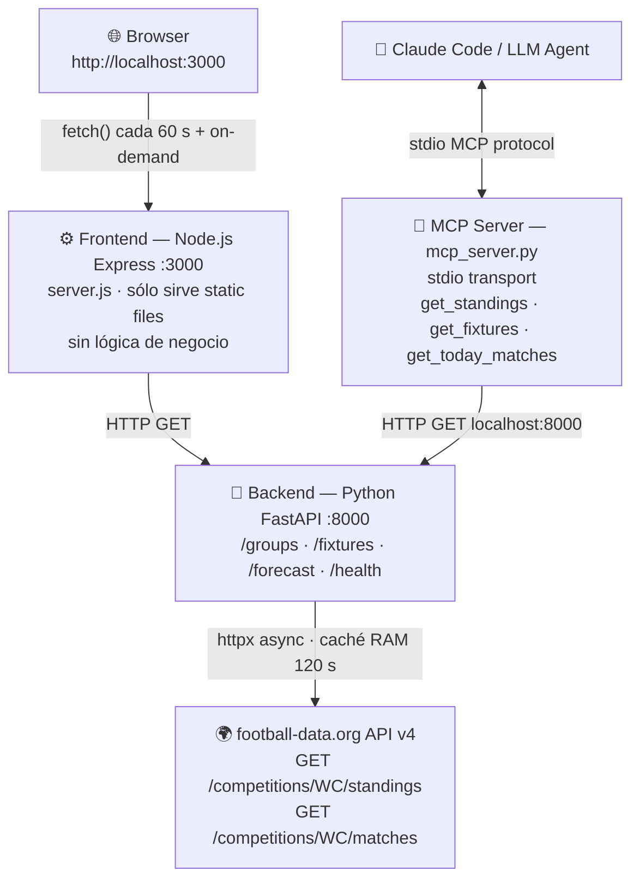

**Regla de oro:** El browser nunca habla directamente con football-data.org. El FastAPI actúa como proxy + caché para respetar el rate limit del tier gratuito (10 req/min).

---

## 3. Estructura de Directorios

```
wc_2026/
├── CLAUDE.md                   # Instrucciones para Claude Code
├── TECHNICAL.md                # Este documento
├── .mcp.json                   # Configuración MCP para Claude Code
├── ranking_fifa_18_meses_completo.csv   # Fuente original de trends FIFA
│
├── backend/
│   ├── .env                    # Variables de entorno (NO en git)
│   ├── .env.example            # Plantilla pública
│   ├── requirements.txt        # Dependencias Python
│   ├── dev.py                  # Watchdog de desarrollo (arranca uvicorn + health-check)
│   ├── mcp_server.py           # Servidor MCP (stdio transport)
│   └── app/
│       ├── main.py             # FastAPI app: CORS, routers
│       ├── routes/
│       │   ├── groups.py       # GET /groups
│       │   ├── fixtures.py     # GET /fixtures
│       │   └── forecast.py     # GET /forecast, GET /forecast/match
│       └── services/
│           ├── football_api.py # Cliente HTTP + caché 120 s para standings y matches
│           ├── venues.py       # Lookup estático: partido → estadio
│           ├── team_data.py    # Datos estáticos: ELO, FIFA pts, valor de mercado, crowd, trends
│           ├── match_predictor.py  # Modelo de predicción partido a partido
│           └── forecasting.py  # Simulador Monte Carlo de torneo completo
│
└── frontend/
    ├── package.json
    ├── server.js               # Express: sirve static assets
    └── public/
    │   └── index.html          # SPA shell (2 tabs: Grupos / Partidos)
    └── src/
        ├── css/styles.css      # Dark theme, gold accents
        └── js/
            ├── api.js          # fetchGroups(), fetchFixtures(), fetchMatchForecast()
            ├── app.js          # Toda la lógica de UI, simulaciones y auto-refresh
            └── third_place_lookup.js  # Tabla precalculada (495 combinaciones) para asignación de 3os
```

---

## 4. Backend en Detalle

### 4.1 Entrypoint — `backend/app/main.py`

```python
app = FastAPI(title="WC 2026 API")
app.add_middleware(CORSMiddleware,
    allow_origins=["http://localhost:3000"],   # sólo el frontend local
    allow_methods=["GET"],
    allow_headers=["*"])
```

- CORS restringido a `localhost:3000`. Si mueves el frontend a otro puerto, actualiza aquí.
- Registra tres routers: `groups_router`, `fixtures_router`, `forecast_router`.
- Endpoint `/health` inline — el watchdog (`dev.py`) lo usa para saber si el servidor vive.

---

### 4.2 Capa de datos externos — `services/football_api.py`

Dos funciones principales:

| Función | URL externa | Caché TTL |
|---|---|---|
| `get_standings()` | `/competitions/WC/standings` | 120 s |
| `get_matches()` | `/competitions/WC/matches` | 120 s |

**Patrón de caché en RAM:**

```python
_cache: dict = {}   # { "standings": {"data": ..., "ts": float} }

def _cached(key):
    entry = _cache.get(key)
    if entry and time.time() - entry["ts"] < CACHE_TTL:
        return entry["data"]
    return None
```

- Simple, sin TTL por invalidación: cada 120 s se refresca.
- No hay persistencia: al reiniciar el proceso, el caché se limpia.
- La API key viene de `os.getenv("FOOTBALL_API_KEY")`.

**Nota de rate limit:** El tier gratuito de football-data.org permite 10 req/min. Con el caché de 120 s y dos endpoints, el backend hace máx. ~2 llamadas/min en condiciones normales.

---

### 4.3 Ruta `/groups` — `routes/groups.py`

Llama a `get_standings()`, filtra sólo entradas con `stage == "GROUP_STAGE"` (el API devuelve también standings de rondas eliminatorias cuando ya hay resultados) y transforma la respuesta a este schema:

```json
[
  {
    "group": "Group_A",
    "stage": "GROUP_STAGE",
    "table": [
      {
        "position": 1,
        "teamId": 764,
        "team": "Mexico",
        "crest": "https://...",
        "played": 3,
        "won": 2,
        "draw": 1,
        "lost": 0,
        "gf": 5,
        "ga": 2,
        "gd": 3,
        "points": 7
      }
    ]
  }
]
```

---

### 4.4 Ruta `/fixtures` — `routes/fixtures.py`

Llama a `get_matches()` y transforma cada partido. Para el campo `venue` aplica una cascada de resolución:

```python
"venue": (
    m.get("venue")                                          # 1. La API lo conoce directamente
    or get_venue(homeTeam.name, awayTeam.name)              # 2. Lookup estático por nombres
    or get_venue_by_id(m["id"])                             # 3. Lookup estático por match_id (knockouts)
)
```

Schema de partido devuelto:

```json
{
  "id": 537417,
  "utcDate": "2026-06-11T18:00:00Z",
  "status": "SCHEDULED",
  "stage": "LAST_32",
  "group": null,
  "homeTeam": {"id": null, "name": "TBD", "crest": ""},
  "awayTeam": {"id": null, "name": "TBD", "crest": ""},
  "score": {"home": null, "away": null},
  "venue": "SoFi Stadium · Los Angeles"
}
```

**Statuses posibles** (vienen del API de football-data.org):
- `SCHEDULED` / `TIMED` — programado
- `IN_PLAY` / `PAUSED` — en curso
- `FINISHED` — jugado
- `POSTPONED` / `CANCELLED`

---

### 4.5 Estadios — `services/venues.py`

Dos diccionarios estáticos de consulta:

1. **`_VENUES`** — keyed por `"HomeTeam|AwayTeam"` usando los nombres exactos del API. Cubre todos los 48 partidos de grupos (12 grupos × 6 partidos = 72 registros) más algunos knockouts.

2. **`_KNOCKOUT_VENUES`** — keyed por `match_id` (int). Para las rondas eliminatorias donde los equipos son TBD hasta que terminen los grupos.

**⚠️ Punto de fricción conocido:** Los nombres de equipo deben coincidir exactamente con los que devuelve football-data.org. Si la API cambia un nombre (ej. "Czechia" vs "Czech Republic"), el lookup falla silenciosamente y el venue queda vacío. El archivo ya tiene duplicados para manejar variantes conocidas.

---

### 4.6 Datos de equipos — `services/team_data.py`

Tres fuentes de datos estáticas (sin BD, sin archivo externo en runtime):

#### `TEAM_DATA` — 95+ selecciones
```python
"Argentina": {"elo": 2060, "fifa_pts": 1862, "market_value_m": 890}
```
- **elo**: ELO de club (club-elo.com), proxy del rendimiento histórico
- **fifa_pts**: Puntos FIFA (nov 2025)
- **market_value_m**: Valor de mercado del plantel en M€ (Transfermarkt, abr 2026)
- Fuente original: `ranking_fifa_18_meses_completo.csv`

#### `CROWD_SUPPORT` — índice 0-100
Estima la ventaja de "localía" en el torneo norteamericano:
- Co-anfitriones (USA=100, México=98, Canadá=85) tienen ventaja máxima
- Diaspora latinoamericana en EE.UU. da ventaja alta a CONMEBOL
- Europa tiene poco apoyo local

#### `TREND_DATA` — trayectoria FIFA dic 2024 → may 2026
```python
"Colombia": {"trend_18m": 22.0, "momentum": 5.0}
```
- **trend_18m**: Cambio en puntos FIFA en 18 meses (ciclo clasificatorio completo)
- **momentum**: Cambio en puntos FIFA ene → may 2026 (forma reciente)

**Fallback:** Si un equipo no está en el dict, se usa `DEFAULT_DATA`, `DEFAULT_CROWD_SUPPORT` o `DEFAULT_TREND`.

---

### 4.7 Modelo de Predicción — `services/match_predictor.py`

#### Visión general

Modelo estadístico **paramétrico** que estima `(p_A_wins, p_draw, p_B_wins)` para cualquier partido. No requiere datos de entrenamiento; todos los parámetros son explícitos y ajustables directamente en el código. Está diseñado para que enchufar un modelo ML entrenado (LightGBM, XGBoost) sea un reemplazo de un solo método.

El pipeline tiene **cuatro pasos secuenciales**:

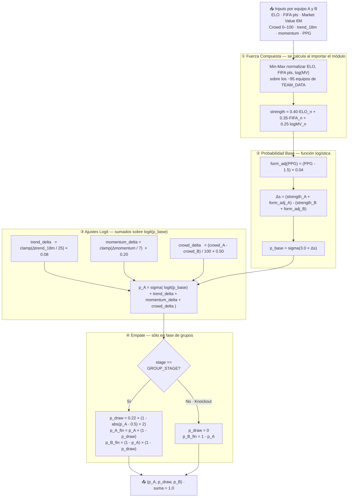

---

#### Paso 1 — Fuerza Compuesta (`_STRENGTHS`)

Se calcula **una única vez al importar el módulo** y se almacena en el dict `_STRENGTHS`. No se recalcula por cada predicción.

**Entradas por equipo** (fuente: `TEAM_DATA` en `team_data.py`):

| Variable | Fuente | Ejemplo: Argentina |
|---|---|---|
| `elo` | club-elo.com — ELO histórico de selecciones | 2060 |
| `fifa_pts` | Ranking FIFA, noviembre 2025 | 1862 |
| `market_value_m` | Transfermarkt, abril 2026 (€M) | 890 |

**Normalización min-max** calculada sobre los ~95 equipos del dict:

```
ELO_n(i)    = (ELO_i    - ELO_min)    / (ELO_max    - ELO_min)
FIFA_n(i)   = (FIFA_i   - FIFA_min)   / (FIFA_max   - FIFA_min)
logMV_n(i)  = (ln(MV_i) - ln(MV_min)) / (ln(MV_max) - ln(MV_min))
```

El valor de mercado se **log-escala** antes de normalizar para comprimir la diferencia entre élites (Francia €1 180M) y equipos pequeños (Comoros €30M).

**Pesos y justificación:**

| Feature | Peso | Justificación |
|---|---|---|
| ELO | **40%** | Rendimiento histórico head-to-head; más estable que el ranking oficial |
| FIFA pts | **35%** | Medida oficial de resultados competitivos del ciclo clasificatorio (4 años) |
| Valor de mercado | **25%** | Proxy de profundidad de plantilla; comprime bien con log |

Resultado: `strength ∈ [0, 1]`. Argentina ≈ 0.97 (máximo), Comoros ≈ 0.01 (mínimo).

---

#### Paso 2 — Probabilidad Base

Ajuste previo de forma actual usando **PPG** (puntos por partido acumulados en el torneo hasta ese momento):

```
form_adj(PPG) = (PPG - 1.5) × 0.04
```

1.5 es el promedio teórico en grupos (si todos los partidos fueran empates). Un equipo con 2.0 PPG gana `+0.02` de fuerza efectiva sobre su valor histórico.

La **función logística** convierte la diferencia de fuerzas en probabilidad:

```
Δs         = (strength_A + form_adj_A) - (strength_B + form_adj_B)
logit_base = K × Δs     donde K = 3.0
p_base     = sigma(logit_base) = 1 / (1 + exp(-logit_base))
```

**Efecto de K = 3.0 sobre la probabilidad base:**

| Δstrength | p_base (prob. equipo A) |
|---|---|
| 0.00 — equipos idénticos | 50.0% |
| 0.20 | 66.4% |
| 0.40 | 80.2% |
| 0.60 | 89.1% |
| 0.80 | 94.6% |
| 1.00 — diferencia máxima | 95.3% |

K más alto → curva más empinada → menos sorpresas. K = 3.0 produce valores realistas para fútbol de selecciones donde existen grandes diferencias de nivel pero los resultados siguen siendo impredecibles.

---

#### Paso 3 — Ajustes en Escala Logit

Los ajustes se suman **en el espacio logit**, no directamente a la probabilidad. Esto garantiza que el resultado siempre esté en `[0, 1]` sin renormalización:

```
p_A_adj = sigma( logit(p_base) + logit_adj )
```

La función auxiliar `_norm_clamp(value, scale)` acota cada delta al rango `[-1, 1]`:

```
norm_clamp(x, scale) = max(-1, min(1, x / scale))
```

**Los tres ajustes y su magnitud:**

| Ajuste | Fórmula | Escala norm. | Coef. logit | Impacto máx. en prob. |
|---|---|---|---|---|
| **Trend 18m** | `norm_clamp(Δtrend, 25) × 0.08` | 25 pts FIFA | 0.08 | ~±2 pp |
| **Momentum** | `norm_clamp(Δmomentum, 7) × 0.20` | 7 pts FIFA | 0.20 | ~±5 pp |
| **Crowd / Localía** | `(crowd_A - crowd_B) / 100 × 0.50` | índice máx. 100 | 0.50 | ~±12 pp |

Las magnitudes de `trend_18m` y `momentum` vienen de `TREND_DATA`:
- **trend_18m**: cambio en puntos FIFA entre diciembre 2024 y mayo 2026 (ciclo clasificatorio completo)
- **momentum**: cambio entre enero 2026 y mayo 2026 (forma de los últimos 5 meses)

El índice `crowd` de `CROWD_SUPPORT` modela la ventaja de localía en Norteamérica:
- Co-anfitriones (USA=100, México=98, Canadá=85): ventaja máxima
- CONCACAF (Honduras=60, El Salvador=58): diáspora latina significativa en EE.UU.
- Sudamérica (Brasil=68, Argentina=65, Colombia=58): comunidades grandes
- Europa (Italia=22, Portugal=20, Polonia=20): comunidades históricas pero menores

**Ejemplo concreto — México (HOME) vs Ecuador (AWAY) en LAST_16:**

```
crowd_delta   = (98 - 52) / 100 × 0.50         = +0.230
trend_delta   = norm_clamp((13.0 - 20.0) / 25) × 0.08
              = norm_clamp(-0.28) × 0.08        = -0.022
momentum_delta = norm_clamp((5.0 - 5.0) / 7)  × 0.20 = 0.000

logit_adj  = +0.208   →   p_México sube ~5 pp por ventaja de localía neta
```

---

#### Paso 4 — Probabilidad de Empate

Solo aplica en fase de grupos. La tasa de empate **escala con la paridad** del encuentro — partidos igualados tienen más empates; partidos muy desiguales prácticamente no:

```
p_draw = P_DRAW_MAX × (1 - abs(p_A - 0.5) × 2)
       = 0.22       × (1 - abs(p_A - 0.5) × 2)
```

| p_A (prob. victoria A) | p_draw | Interpretación |
|---|---|---|
| 0.50 — paridad perfecta | **22.0%** | Máxima tasa histórica de empate en partidos WC |
| 0.60 | 17.6% | Ligero favorito |
| 0.70 | 13.2% | Favorito claro |
| 0.80 | 8.8% | Gran diferencia de nivel |
| 0.90 | 4.4% | Partido muy desigual |
| 1.00 | 0.0% | Dominancia absoluta |

Redistribución final — las tres probabilidades suman exactamente 1.0:

```
p_A_fin = p_A_adj × (1 - p_draw)
p_B_fin = (1 - p_A_adj) × (1 - p_draw)
check:    p_A_fin + p_draw + p_B_fin = 1.0  ✓
```

En rondas eliminatorias: `p_draw = 0`, `p_B_fin = 1 - p_A_adj`.

---

#### Vector de features para ML (`build_features`)

`build_features()` devuelve el dict de 8 features listo para pasar a un modelo entrenado:

| # | Feature | Descripción |
|---|---|---|
| 1 | `elo_diff` | ELO_A − ELO_B (sin normalizar) |
| 2 | `fifa_pts_diff` | FIFA_pts_A − FIFA_pts_B |
| 3 | `market_value_ratio` | ln(MV_A) − ln(MV_B) |
| 4 | `form_diff` | PPG_A − PPG_B |
| 5 | `crowd_support_diff` | crowd_A − crowd_B |
| 6 | `trend_18m_diff` | trend_A − trend_B |
| 7 | `momentum_diff` | momentum_A − momentum_B |
| 8 | `is_knockout` | 0 ó 1 |

#### API pública — singleton `predictor`

```python
predictor = MatchPredictor()   # importar este objeto directamente

# Devuelve (p_home, p_draw, p_away) — suma 1.0
predictor.predict("Argentina", "France", ppg_a=1.8, stage="GROUP_STAGE")

# Devuelve {"base": {...}, "withCrowd": {...}, "crowdImpact": "..."}
predictor.predict_both("Mexico", "USA", stage="SEMI_FINALS")

# Devuelve dict de 8 features (debug o input a LightGBM)
predictor.build_features("Brazil", "Germany")
```

#### Upgrade path: conectar LightGBM

```python
# match_predictor.py — agregar al inicio del módulo:
import lightgbm as lgb
booster = lgb.Booster(model_file="backend/model.json")

# Reemplazar SOLO el cuerpo de predict():
def predict(self, name_a, name_b, ppg_a=1.5, ppg_b=1.5,
            stage="GROUP_STAGE", apply_crowd=True):
    feats = self.build_features(name_a, name_b, ppg_a, ppg_b, stage, apply_crowd)
    preds = booster.predict([list(feats.values())])[0]   # → [p_a, p_draw, p_b]
    return float(preds[0]), float(preds[1]), float(preds[2])
```

`build_features()` ya produce las 8 features en el orden correcto.

---

### 4.8 Simulador Monte Carlo — `services/forecasting.py`

#### Objetivo y fundamento estadístico

Estima la **probabilidad de campeonato** de cada equipo corriendo **10 000 simulaciones** del torneo completo. En lugar de calcular analíticamente el árbol de probabilidades (computacionalmente inviable para 48 equipos en 7 rondas con infinitas ramas), se simulan muchos torneos y se cuentan los resultados:

```
P(campeón = equipo X) ≈ win_counts[X] / 10 000
```

Con 10 000 simulaciones, el **error estándar** de cada estimación es:

```
SE = sqrt(p × (1-p) / n)
```

Para un favorito con 20% de probabilidad: SE ≈ ±0.4 pp. Para un candidato con 5%: SE ≈ ±0.2 pp. Las probabilidades resultantes son precisas al **±1 pp** para todos los equipos.

---

#### Arquitectura de caché — dos capas independientes

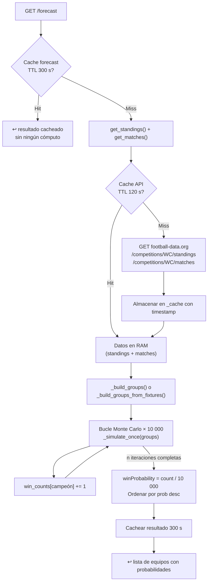

- **Capa interna — 120 s (`football_api.py`):** protege el rate limit de football-data.org (10 req/min gratuito). Si el backend recibe ráfagas de requests, sólo 1 llamada cada 2 min llega al exterior.
- **Capa externa — 300 s (`forecasting.py`):** evita recalcular 10 000 simulaciones en cada request. La simulación tarda ~0.5 s en un Mac moderno, pero sería molesto pagar ese costo en cada call de API.

---

#### Paso 1 — Construcción de grupos

Antes de simular, se parsean los datos de la API en estructuras que el simulador puede consumir. Hay dos caminos según la fase del torneo:

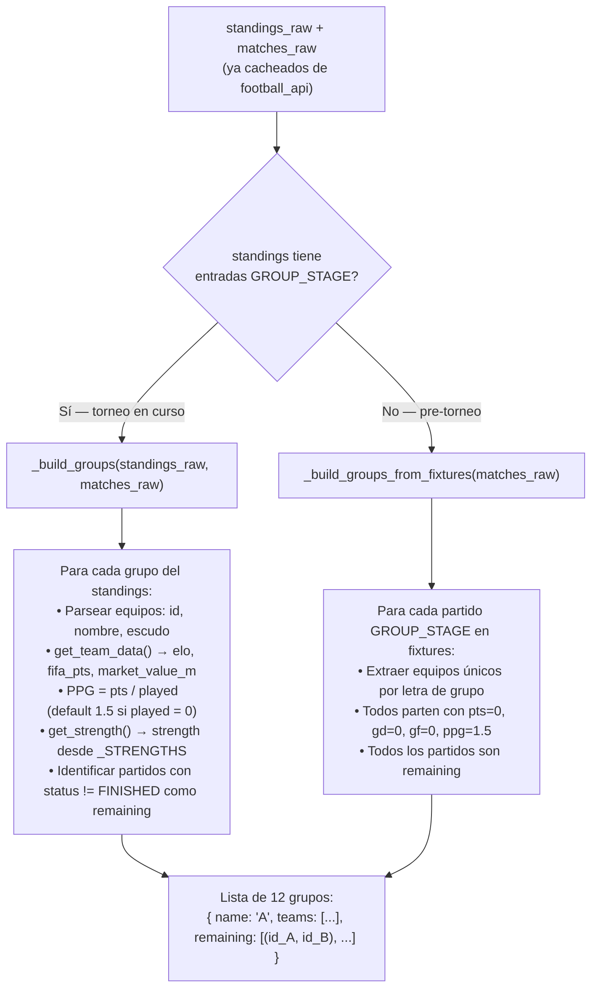

Estructura del objeto equipo dentro del grupo:

```python
{
    "id": 764,
    "name": "Mexico",
    "group": "A",
    "strength": 0.83,        # de _STRENGTHS — fuerza pre-calculada al importar
    "elo": 1860,
    "fifaPoints": 1606,
    "marketValueM": 340,
    "pts": 4,                # puntos reales acumulados hasta ahora (standings API)
    "gd": 2,  "gf": 5,
    "played": 2,
    "ppg": 2.0               # 4 pts / 2 partidos — retroalimenta el predictor
}
```

> **El campo `ppg` es clave:** retroalimenta el modelo de predicción con la **forma real del equipo dentro del torneo**, no sólo sus stats históricas. Un equipo que lleva 3/3 tiene `ppg=3.0` y eso sube su probabilidad de victoria en los partidos simulados restantes.

---

#### Paso 2 — Simulación de un torneo completo (`_simulate_once`)

Esta función simula un torneo entero de principio a fin y retorna el nombre del campeón. Se llama 10 000 veces.

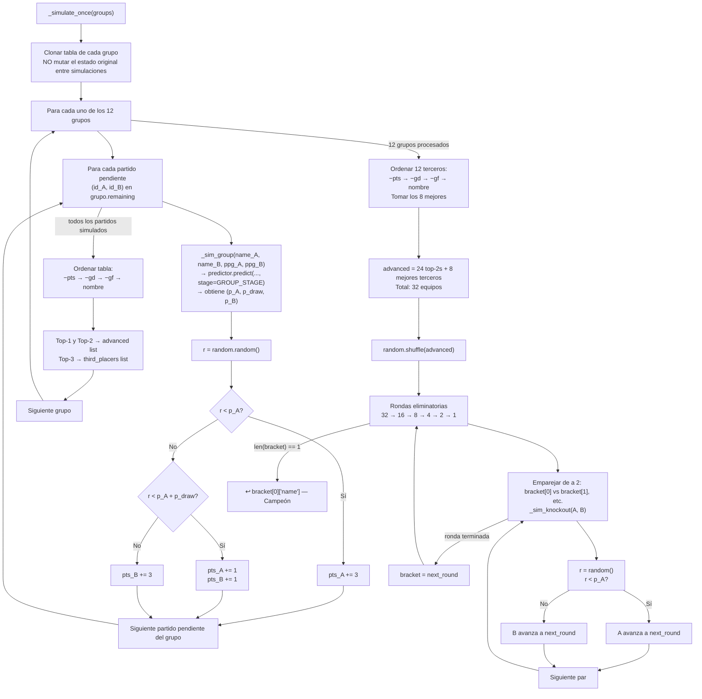

---

#### Paso 3 — Selección de los 8 mejores terceros

El WC 2026 tiene 12 grupos → 12 equipos en tercer lugar. Solo **8 avanzan** a la ronda de 32 (24 top-2s + 8 mejores terceros = 32). El criterio en el simulador:

```
1°  Mayor puntos acumulados en el torneo simulado
2°  Mayor diferencia de goles
3°  Mayor goles a favor
4°  Nombre alfabético (desempate determinístico, sin aleatoriedad)
```

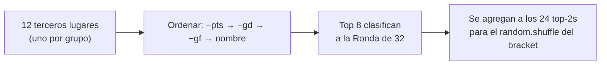

> **Diferencia con el frontend:** En `app.js`, la asignación exacta de terceros a los slots del bracket sigue el **FIFA Annex C** (tabla precalculada en `third_place_lookup.js` con 495 combinaciones). El simulador Python no respeta esa asignación — simplemente añade los terceros al pool y shufflea. Esto produce **estimaciones estadísticamente correctas en promedio**, aunque no replica la estructura exacta del bracket.

---

#### Paso 4 — Aleatorización del bracket

```python
random.shuffle(advanced)   # advanced = lista de 32 equipos
```

FIFA no ha publicado las reglas de emparejamiento para el formato de 48 equipos / 12 grupos del WC 2026. El `random.shuffle` es un placeholder deliberado que produce estimaciones **imparciales**: cada equipo tiene igual probabilidad esperada de enfrentarse a cualquier otro en cualquier ronda. Cuando FIFA publique las reglas, reemplazar el shuffle por la lógica oficial en `_simulate_once()`.

---

#### Paso 5 — Agregación y resultado final

```python
win_counts: dict[str, int] = defaultdict(int)
for _ in range(10_000):
    champion = _simulate_once(groups)
    if champion:
        win_counts[champion] += 1

all_teams = {t["name"]: t for grp in groups for t in grp["teams"]}

result = [
    {
        "teamId":         team["id"],
        "team":           name,
        "crest":          team.get("crest", ""),
        "group":          team.get("group", ""),
        "elo":            team["elo"],
        "fifaPoints":     team["fifaPoints"],
        "marketValueM":   team["marketValueM"],
        "strength":       round(team["strength"], 4),
        "winProbability": round(win_counts.get(name, 0) / n, 4),  # ej. 0.1823
        "winPct":         round(win_counts.get(name, 0) / n * 100, 2),  # ej. 18.23
        "simulations":    n,
    }
    for name, team in all_teams.items()
]
result.sort(key=lambda x: -x["winProbability"])

_cache["forecast"] = {"data": result, "ts": time.time()}
return result
```

---

#### Funciones de simulación de partido

Las dos funciones internas que convierten probabilidades en resultados discretos mediante un número aleatorio:

```python
def _sim_group(name_a, name_b, ppg_a, ppg_b) -> tuple[int, int]:
    """Simula un partido de grupo. Devuelve (pts_a, pts_b): 3-0, 1-1 ó 0-3."""
    p_a, p_draw, _ = predictor.predict(name_a, name_b, ppg_a, ppg_b, stage="GROUP_STAGE")
    r = random.random()
    if r < p_a:            return 3, 0   # Victoria A
    if r < p_a + p_draw:   return 1, 1   # Empate
    return 0, 3                           # Victoria B


def _sim_knockout(name_a, name_b) -> bool:
    """Simula un partido eliminatorio. Devuelve True si A gana."""
    p_a, _, _ = predictor.predict(name_a, name_b, stage="KNOCKOUT")
    return random.random() < p_a          # No hay empate posible
```

> El PPG que entra a `_sim_group` es el PPG **simulado acumulado** dentro de esa iteración (no el real de la API), porque a medida que se juegan los partidos del grupo en la simulación, los puntos se van sumando a la copia clonada del equipo.

---

#### Limitaciones conocidas del simulador

| Limitación | Impacto en la estimación | Mejora posible |
|---|---|---|
| Bracket aleatorio (`random.shuffle`) | Las prob. de cruzarse con favoritos se promedian; puede sub/sobreestimar equipos según el grupo | Implementar el draw oficial cuando FIFA lo publique |
| GD/GF ficticios (+2/−1 por partido simulado) | Las tablas simuladas pueden diferir en desempates por GD/GF | Simular marcadores con distribución de Poisson (λ por equipo) |
| Datos estáticos al arrancar | No refleja lesiones, sanciones ni forma intratorneo (más allá del PPG) | Actualizar `team_data.py` manualmente y reiniciar el backend |
| Penales no modelados explícitamente | Knockouts resueltos en 90 min teóricos; `p_A` knockout engloba penales implícitamente | Separar fases: 90 min → tiempo extra → penales con probabilidades históricas |
| n = 10 000 fijo | SE ≈ ±0.4 pp para el favorito; ±0.2 pp para un equipo con 5% | Aumentar a 50 000 para SE < ±0.2 pp (5× más lento, ~2.5 s) |

---

### 4.9 Ruta `/forecast/match` — `routes/forecast.py`

Endpoint para pronóstico de un partido específico. Síncrono (no async), sólo llama a funciones en memoria.

**Query params:** `home`, `away`, `stage`

**Response:**
```json
{
  "home": "Argentina",
  "away": "France",
  "stage": "GROUP_STAGE",
  "homeStats": {"elo": 2060, "fifaPoints": 1862, "marketValueM": 890, "crowdSupport": 65, "trend18m": 15.0, "momentum": 5.0},
  "awayStats": {...},
  "crowdSupport": {"home": 65, "away": 14, "netAdvantage": 51},
  "features": {"elo_diff": 50, "fifa_pts_diff": 86, ...},
  "base": {"homeWin": 0.4823, "draw": 0.1901, "awayWin": 0.3276},
  "withCrowd": {"homeWin": 0.5241, "draw": 0.1789, "awayWin": 0.2970},
  "crowdImpact": "+4.2% para Argentina"
}
```

---

### 4.10 Watchdog de Desarrollo — `dev.py`

Wrapper sobre `uvicorn --reload` con auto-restart:

- Lanza uvicorn en subprocess
- Cada 15 s hace GET a `/health`
- Si 3 fallos consecutivos → kill + restart
- Maneja `SIGINT`/`SIGTERM` limpiamente

```bash
cd backend && source venv/bin/activate && python dev.py
```

---

## 5. Frontend en Detalle

### 5.1 Servidor — `frontend/server.js`

Express minimalista. Su único trabajo es servir archivos estáticos:

```
/         → public/index.html
/src/...  → src/ (CSS, JS)
*         → public/index.html  (SPA fallback, aunque no hay rutas cliente)
```

```bash
cd frontend && npm run dev   # nodemon para auto-reload
```

### 5.2 HTML — `public/index.html`

SPA de dos tabs sin framework:
- `#panel-groups` — tabla de grupos
- `#panel-fixtures` — calendario de partidos con filtros

Carga tres scripts en orden (dependencias implícitas):
```html
<script src="/src/js/api.js"></script>             <!-- 1. fetch wrappers -->
<script src="/src/js/third_place_lookup.js"></script> <!-- 2. tabla precalculada -->
<script src="/src/js/app.js"></script>             <!-- 3. lógica principal -->
```

### 5.3 Capa de API — `frontend/src/js/api.js`

Tres funciones de fetch, todas usan `API_BASE = 'http://localhost:8000'`:

| Función | Endpoint | Uso |
|---|---|---|
| `fetchGroups()` | `GET /groups` | Tabla de grupos |
| `fetchFixtures()` | `GET /fixtures` | Todos los partidos |
| `fetchMatchForecast(home, away, stage)` | `GET /forecast/match?home=...` | Pronóstico on-demand |

### 5.4 Lógica de UI — `frontend/src/js/app.js`

Este es el archivo más complejo. Funciones clave:

#### Estado global
```javascript
let allFixtures = [];          // partidos cargados del backend
let baseGroups = [];           // grupos originales del backend
let currentSimGroups = [];     // grupos con simulaciones aplicadas
let simulations = {};          // { matchId: 'HOME'|'AWAY'|'DRAW' } — persiste en localStorage
let forecasts = {};            // { matchId: {homeWin, draw, awayWin} } — volátil
```

#### Ciclo de vida

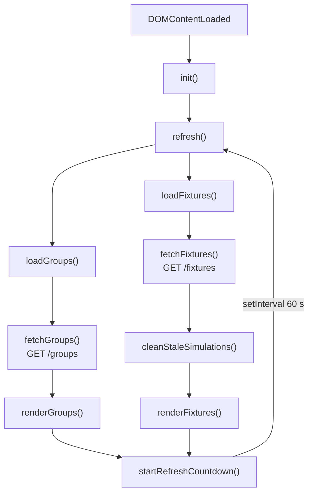

#### Simulaciones de usuario

El usuario puede hacer click en "Argentina / Empate / France" en cualquier partido SCHEDULED:

```javascript
function saveSimulation(matchId, result) {
  simulations[matchId] = result;            // toggle si ya estaba activo
  localStorage.setItem('wc_simulations', JSON.stringify(simulations));
  renderGroups();    // recalcula tablas con resultado hipotético
  renderFixtures();  // actualiza bracket proyectado
}
```

`applySimulationsToGroups()` clona los grupos y aplica los resultados hipotéticos a PJ, G, E, P, GF, GC, DG, PTS. Las filas con simulación se marcan con clase CSS `sim-row` y badge "SIM".

#### Proyección del cuadro eliminatorio

El sistema resuelve los "TBD" en partidos eliminatorios de forma recursiva:

```javascript
function resolveMatchTeam(match, side) {
  // 1. Si la API ya conoce el equipo, usarlo
  if (apiTeam.name && apiTeam.name !== 'TBD') return apiTeam;
  // 2. Consultar KNOCKOUT_BRACKET para saber qué slot ocupa
  const bracket = KNOCKOUT_BRACKET[match.id];
  // 3. Resolver el slot (w_A, r_B, t_ABCDF, win_537417, lose_537388...)
  return getProjectedTeam(bracket.home);
}
```

`KNOCKOUT_BRACKET` es un diccionario hardcodeado con los 32 partidos eliminatorios y sus slots (`w_A` = 1° del grupo A, `r_B` = 2° del grupo B, `t_ABCDF` = mejor tercero de los grupos A/B/C/D/F, `win_537417` = ganador del partido 537417).

#### Asignación de terceros — `third_place_lookup.js`

El Mundial 2026 tiene 12 grupos de 4 equipos. Los 8 mejores terceros avanzan. Pero los slots del bracket dependen de qué grupos específicos aportaron los terceros (FIFA Annex C). El archivo precalcula las 495 combinaciones posibles (C(12,8) = 495):

```javascript
const THIRD_PLACE_LOOKUP = {
  "EFGHIJKL": {"t_CEFHI": "E", "t_EFGIJ": "J", ...},
  ...
}
```

La clave es la cadena de 8 letras de grupos ordenadas alfabéticamente. Generada offline (no es código de producción modificable fácilmente).

#### Pronóstico por partido (botón ⚡)

```javascript
fcBtn → fetchMatchForecast(home, away, stage)
      → forecasts[matchId] = { homeWin, draw, awayWin }
      → saveSimulation(matchId, best)  // aplica el resultado más probable automáticamente
```

Las probabilidades aparecen junto a los botones de simulación como `<span class="sim-prob">54%</span>`.

### 5.5 Estilos — `frontend/src/css/styles.css`

Dark theme (`#0d0d1f` background) con acento dorado (`#c9a227`). Sin framework CSS.

Clases de estado por partido:
- `.sim-winner` / `.sim-loser` / `.sim-draw` — colores verde/rojo/amarillo según resultado
- `.sim-row` — fila de tabla con resultado hipotético (texto en cursiva o diferente color)
- `.live` — borde pulsante para partidos EN VIVO
- `.projected` — partido con equipos proyectados (no confirmados por API)
- `.host-mx` / `.host-ca` / `.host-us` — color de borde según sede anfitriona

---

## 6. MCP Server — `backend/mcp_server.py`

Servidor [Model Context Protocol](https://modelcontextprotocol.io/) que permite a Claude (u otro LLM) consultar datos del torneo como herramientas.

### Herramientas expuestas

| Tool | Descripción | Parámetros |
|---|---|---|
| `get_standings` | Posiciones de grupos | `group?: "A"-"L"` |
| `get_fixtures` | Partidos con filtros | `team?`, `status?`, `stage?` |
| `get_today_matches` | Partidos de hoy (UTC) | ninguno |

### Arquitectura interna

```python
BACKEND_URL = "http://localhost:8000"

async def _fetch(path) → list:
    # Hace GET al FastAPI backend (que ya tiene caché)
    # Lanza RuntimeError con mensaje amigable si el backend no corre
```

El MCP server es un **cliente** del FastAPI backend — no llama directamente a football-data.org. Esto significa que necesitas que el backend esté corriendo para que el MCP funcione.

### Configuración en `.mcp.json`

```json
{
  "mcpServers": {
    "wc2026": {
      "command": "/ruta/a/venv/bin/python",
      "args": ["/ruta/a/mcp_server.py"]
    }
  }
}
```

Claude Code lo carga automáticamente al abrir el proyecto. Las herramientas aparecen como `mcp__wc2026__get_standings`, etc.

---

## 7. Configuración y Arranque

### Prerequisitos

- Python 3.11+
- Node.js 18+
- API key gratuita de [football-data.org](https://www.football-data.org/client/register)

### Setup completo (primera vez)

```bash
# 1. Backend
cd backend
python -m venv venv
source venv/bin/activate          # Windows: venv\Scripts\activate
pip install -r requirements.txt
cp .env.example .env
# Editar .env: FOOTBALL_API_KEY=tu_key_aqui

# 2. Frontend
cd ../frontend
npm install
```

### Variables de entorno (`backend/.env`)

```env
FOOTBALL_API_KEY=abc123xyz        # Requerido
FOOTBALL_API_URL=https://api.football-data.org/v4   # Opcional, este es el default
```

### Arranque diario

```bash
# Terminal 1 — Backend
cd backend && source venv/bin/activate && python dev.py

# Terminal 2 — Frontend
cd frontend && npm run dev

# Abrir navegador en http://localhost:3000
```

### Verificar que todo funciona

```bash
curl http://localhost:8000/health   # {"status": "ok"}
curl http://localhost:8000/groups | python -m json.tool | head -30
curl http://localhost:8000/fixtures | python -m json.tool | head -30
```

---

## 8. Flujos de Datos Completos

### Flujo 1: Carga inicial de grupos

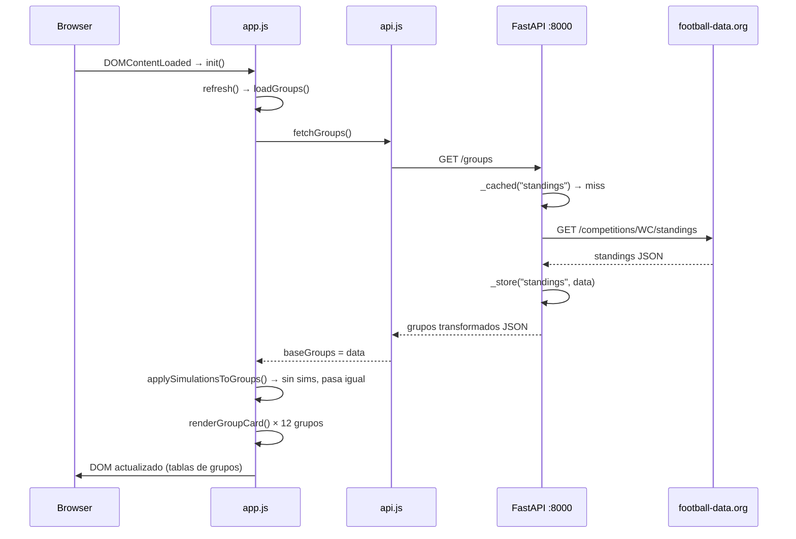

### Flujo 2: Simulación de un partido

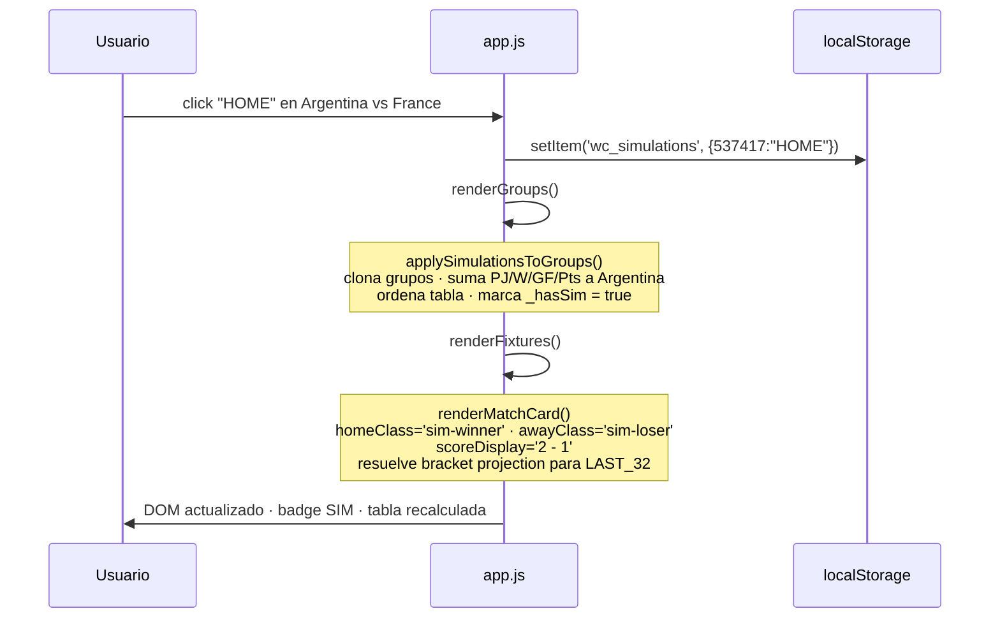

### Flujo 3: Pronóstico ⚡

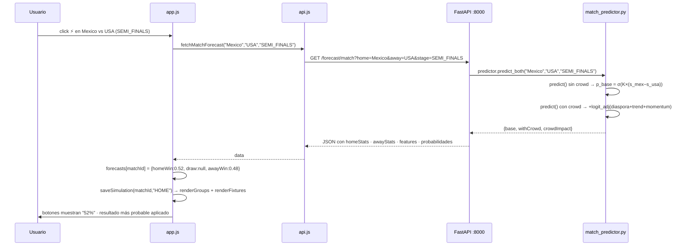

### Flujo 4: Monte Carlo `/forecast`

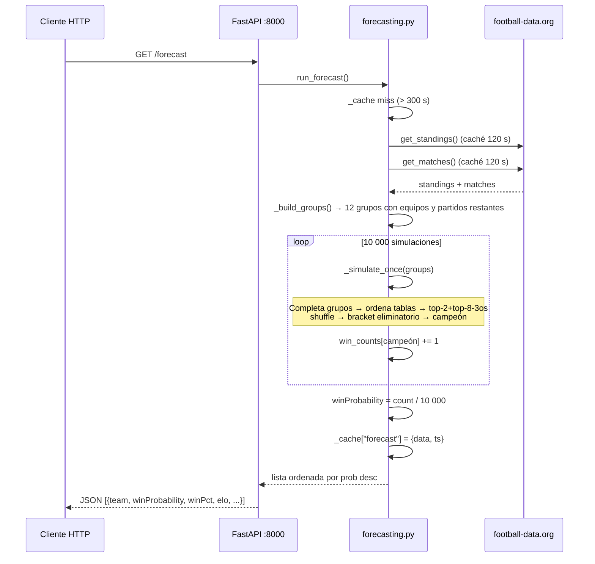

---

## 9. Convenciones y Decisiones de Diseño

### Por qué no hay base de datos

El torneo dura ~5 semanas. Los datos cambian despacio (máx. 64 partidos totales). Una BD añadiría complejidad sin beneficio real para uso local.

### Por qué los datos de equipos son estáticos

- FIFA pts, ELO y valores de mercado tienen actualizaciones mensuales/trimestrales
- Durante el torneo ya no cambian
- Un dict en Python es O(1) lookup y fácil de editar a mano
- El CSV `ranking_fifa_18_meses_completo.csv` es la fuente de referencia para auditar los valores

### Por qué el MCP server habla con el FastAPI y no directamente con football-data.org

- Reutiliza la caché del backend
- No necesita su propia API key
- Aislamiento: cambios en el cliente HTTP van en un solo lugar

### Por qué `third_place_lookup.js` está precalculado

FIFA Annex C define para cada una de las 495 combinaciones posibles de 8 grupos cuál tercero va a qué slot del bracket. Generarlo en runtime es posible pero innecesario; el archivo estático es más claro y sin riesgo de bug.

### Por qué el simulador de torneo hace `random.shuffle(bracket)`

FIFA no ha publicado las reglas de emparejamiento para el nuevo formato de 32 equipos en rondas de 32. El shuffle da probabilidades a priori imparciales. Cuando se publiquen las reglas, se puede reemplazar por el bracket real.

---

## 10. Cómo Extender el Proyecto

### Añadir un nuevo endpoint al backend

1. Crear `backend/app/routes/mi_ruta.py` con `router = APIRouter()`
2. Añadir la lógica de servicio en `backend/app/services/mi_servicio.py` si es compleja
3. Registrar en `backend/app/main.py`:
   ```python
   from app.routes.mi_ruta import router as mi_router
   app.include_router(mi_router)
   ```

### Añadir un equipo al modelo de predicción

Editar `backend/app/services/team_data.py`:
```python
TEAM_DATA["Nuevo País"] = {"elo": 1750, "fifa_pts": 1400, "market_value_m": 120}
CROWD_SUPPORT["Nuevo País"] = 15
TREND_DATA["Nuevo País"] = {"trend_18m": 8.0, "momentum": 1.0}
```
El modelo recalcula `_STRENGTHS` al importar el módulo.

### Conectar un modelo ML entrenado

1. Exportar el modelo como `backend/model.json` (LightGBM) o `model.pkl` (sklearn)
2. En `match_predictor.py`, cargar al inicio del módulo:
   ```python
   import lightgbm as lgb
   booster = lgb.Booster(model_file="model.json")
   ```
3. Reemplazar el cuerpo de `MatchPredictor.predict()`:
   ```python
   feats = self.build_features(name_a, name_b, ...)
   preds = booster.predict([list(feats.values())])[0]  # [p_a, p_draw, p_b]
   return tuple(preds)
   ```
   `build_features()` ya devuelve las 8 features en el orden correcto.

### Añadir una herramienta al MCP server

En `backend/mcp_server.py`:
```python
# 1. En list_tools(), agregar Tool(name="mi_tool", ...)
# 2. En call_tool(), agregar bloque `if name == "mi_tool": ...`
```

### Actualizar los datos estáticos de equipos

1. Bajar el último ranking FIFA de [fifa.com/rankings](https://www.fifa.com/fifa-world-ranking/)
2. Bajar valores de mercado de [transfermarkt.com](https://www.transfermarkt.com/)
3. Actualizar `team_data.py` manualmente o con un script que lea el CSV
4. Reiniciar el backend (el caché en RAM se recalcula al importar)

---

## 11. Puntos de Atención para el Próximo Desarrollador

### 🔴 Crítico
- **API Key en `.env`** — nunca commitear, el `.gitignore` ya lo excluye pero verificar que `.env` no esté tracked.
- **Nombres de equipo** — El lookup de venues y team_data usa los nombres exactos de football-data.org. Si la API devuelve "Ivory Coast" pero el dict tiene "Côte d'Ivoire", el equipo cae al fallback. Ya hay duplicados para los casos conocidos; si aparece un nuevo alias, añadirlo.

### 🟡 Importante
- **Rate limit** — El tier gratuito de football-data.org es 10 req/min. El caché de 120 s es suficiente en condiciones normales, pero si reinicias el backend muchas veces o haces múltiples llamadas simultáneas puedes llegar al límite. El error HTTP 429 se propaga como 502 al cliente.
- **Caché de Monte Carlo** — 5 minutos (300 s). Durante partidos en vivo, el forecast puede estar desactualizado hasta 5 min. Para torneos reales esto es aceptable; ajustar `CACHE_TTL` en `forecasting.py` si se necesita más frecuencia.
- **Bracket del sorteo** — `random.shuffle(advanced)` en `_simulate_once()` es un placeholder. Cuando FIFA publique el bracket real del WC 2026 (ronda de 32), reemplazar con la lógica oficial.

### 🟢 Mejoras futuras sugeridas
- **LightGBM** — El `MatchPredictor` está diseñado para enchufar un modelo entrenado; ver sección 10.
- **Persistencia de caché** — Un Redis o SQLite evitaría que el caché se pierda al reiniciar.
- **WebSocket para scores en vivo** — Actualmente el frontend hace polling cada 60 s; para partidos en vivo un WebSocket daría mejor UX.
- **Tests** — No hay tests unitarios. Prioritario: `match_predictor.py` (lógica matemática) y `forecasting.py` (simulador).
- **Docker Compose** — Simplificaría el arranque a un solo `docker compose up`.

---

## 12. Diagrama de Dependencias de Módulos

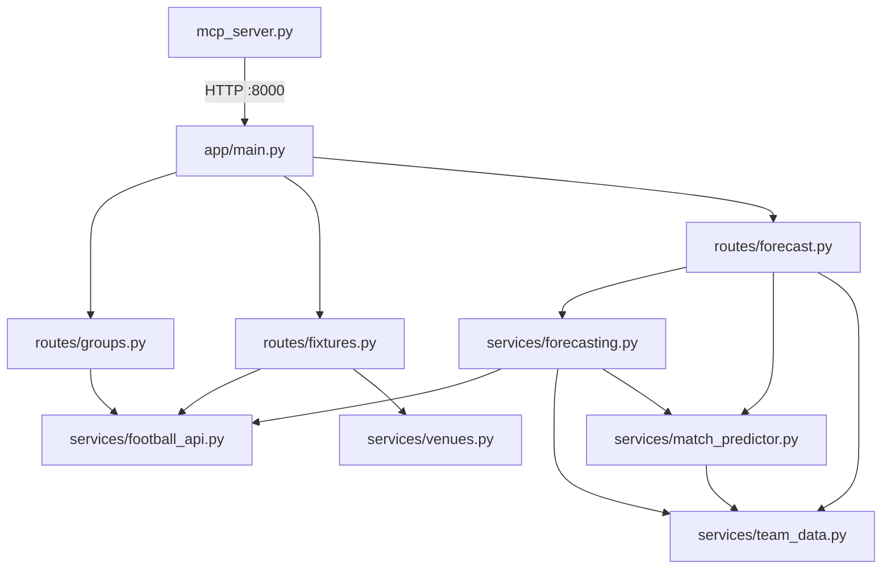

---

## 13. Variables de Configuración Relevantes

| Archivo | Variable | Valor actual | Descripción |
|---|---|---|---|
| `football_api.py` | `CACHE_TTL` | 120 s | TTL del caché de standings y matches |
| `football_api.py` | `COMPETITION` | `"WC"` | Código de competencia en football-data.org |
| `forecasting.py` | `CACHE_TTL` | 300 s | TTL del caché de Monte Carlo |
| `forecasting.py` | `n` en `run_forecast()` | 10 000 | Número de simulaciones |
| `match_predictor.py` | `_K` | 3.0 | Escala logística (sensibilidad a diferencia de fuerza) |
| `match_predictor.py` | `_P_DRAW_GROUP` | 0.22 | Tasa de empate máxima en fase de grupos |
| `match_predictor.py` | `_CROWD_K` | 0.5 | Peso del factor localía |
| `match_predictor.py` | `_TREND_K` | 0.08 | Peso del trend de 18 meses |
| `match_predictor.py` | `_MOMENTUM_K` | 0.20 | Peso del momentum reciente |
| `dev.py` | `CHECK_INTERVAL` | 15 s | Frecuencia del health check del watchdog |
| `dev.py` | `FAIL_THRESHOLD` | 3 | Fallos consecutivos antes de hard restart |
| `app.js` | `REFRESH_INTERVAL` | 60 000 ms | Auto-refresh del browser |
| `api.js` | `API_BASE` | `http://localhost:8000` | URL del backend |

---

## 14. Forecasting Pre-Partido (añadido en jornada 1)

Infraestructura agregada tras validar el modelo en los dos primeros
partidos (MX 2-0 SA, KOR 2-1 CZE — modelo 2/2 contra el mercado).

### Afinidad real en `/forecast/match`

El endpoint pasaba afinidad neutral (50/50) al predictor, anulando el
factor cohesión. Ahora usa `_get_affinity()` (de `forecasting.py`, que
lee `squad_context_v3.json`) y expone `affinity` en `homeStats` /
`awayStats`. El mapa `player_club_map.json` cubre 26/26 convocados de
KOR y CZE; el resto de selecciones tiene cobertura parcial (la receta
para completarla está en `enrich_apif.py` + búsqueda dirigida por liga).

### Ledger de pronósticos — `services/forecast_ledger.py`

Cada llamada a `/forecast/match` y cada corrida de `prematch.py`
registran un snapshot (modelo/mercado/blended + afinidades) en
`forecast_ledger.json`. `GET /forecast/ledger` evalúa el último
snapshot **pre-kickoff** de cada partido terminado y reporta Brier
score por capa. Objetivo: calibrar el modelo con evidencia acumulada
(104 partidos) y no con anécdotas.

### CLI pre-partido — `backend/prematch.py`

```bash
python prematch.py "Canada" "Bosnia-Herzegovina" --date 2026-06-12
```

Pipeline completo: XI probable (titulares más frecuentes en los últimos
5 partidos de selección, vía API-Football con caché en
`apif_cache/nt_last5_cache.json`), afinidad extendida (club/liga +
titularidades compartidas, noisy-or NT_W=0.85), predictor + blend con
mercado, marcadores Poisson condicionados y registro en el ledger.
Advertencia automática si el historial es 100% amistosos (XI por
frecuencia poco fiable — lección KOR: rotaron amistosos y alinearon a
sus estrellas en el oficial).

### Localía por país-sede — `CROWD_SUPPORT_BY_HOST`

`CROWD_SUPPORT` modela diáspora en USA/Canadá y es ciego a la sede.
`CROWD_SUPPORT_BY_HOST` (en `team_data.py`) permite overrides por país
anfitrión — p.ej. Corea del Sur = 22 en sedes mexicanas (Hallyu +
hinchada viajera + comunidad residente). `get_crowd_support(name,
host_country)` lo aplica; el predictor resuelve el host desde la sede.

### Etiquetado de origen de goles — `goal_origin_tags.json`

API-Football no distingue jugada armada de balón parado. Este archivo
acumula el etiquetado manual de cada gol del torneo; con ~50+ goles la
idea es partir la λ de goles en `λ_jugada + λ_balón_parado` por equipo
y cruzarla contra la vulnerabilidad defensiva específica del rival.

---

*Generado con Claude Code · Mayo 2026*
